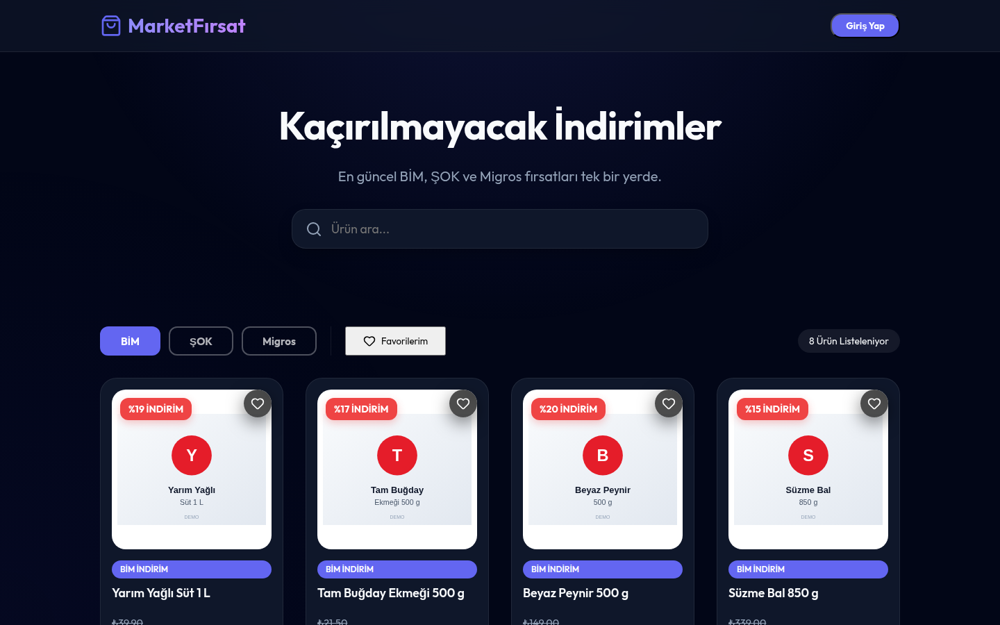
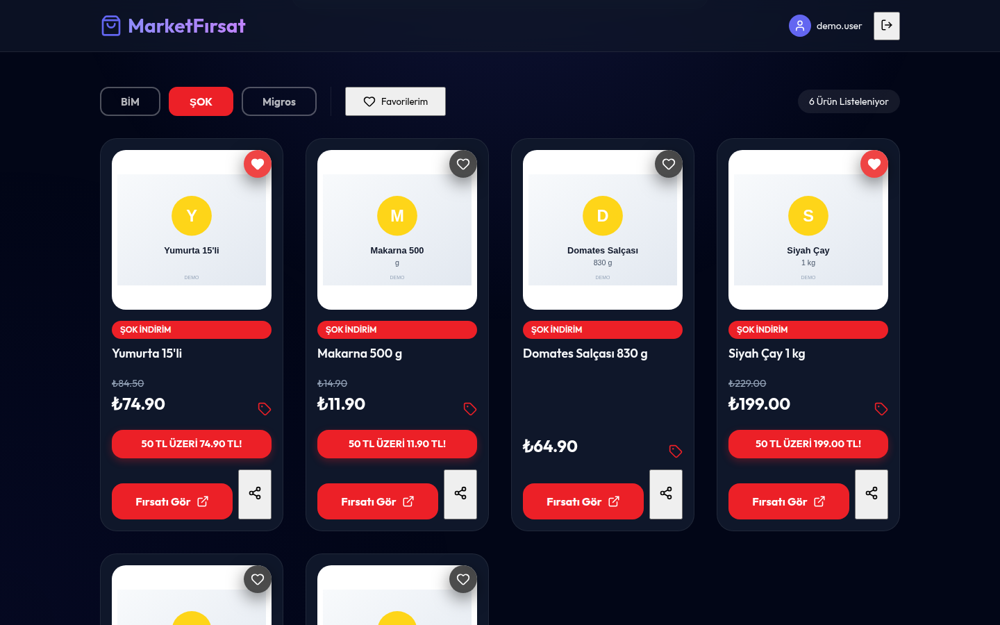
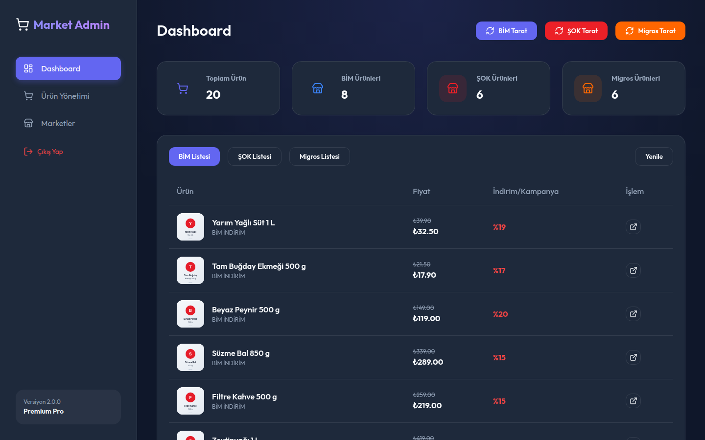
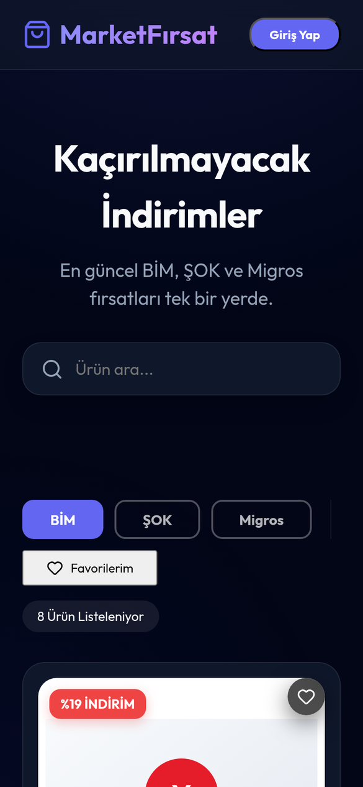
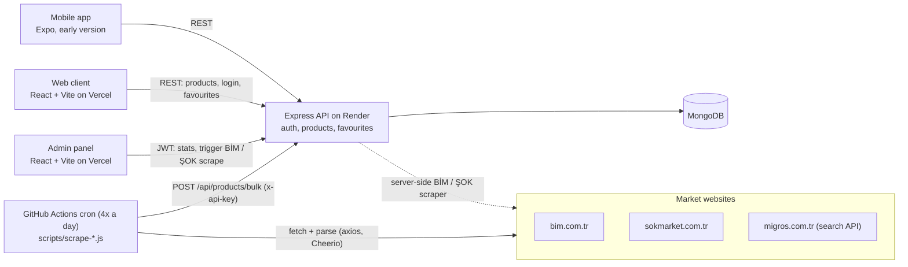

<p align="center">
  
</p>

# MarketApp — Supermarket Deals in One Place

**MarketApp collects the weekly discount products of Turkish supermarket chains (BİM, ŞOK and Migros) with scheduled scrapers and shows them in one web app, an admin panel and an early mobile app.**

[](https://github.com/CoskunerBerke/MarketApp/actions/workflows/ci.yml)


**Backend API (Render):** https://market-backend-oozv.onrender.com — health check at `/api/system/health`.

> **Status:** working prototype / personal project. The web client, admin panel and API work; the mobile app is an
> early version. Product data comes from the chains' public web pages and belongs to them; this project is not
> affiliated with any of the chains.

<p align="center">
  
</p>

| Signed in, ŞOK deals with favourites and promotion badges | Admin dashboard | Phone (390 px) |
|---|---|---|
|  |  |  |

<sub>Screenshots of the app running locally with fictional demo data from <code>seed:demo</code> (made-up products, prices and placeholder images), not real offers.</sub>

## Contents

- [Overview](#overview) · [Features](#features) · [Architecture](#architecture) · [Tech stack](#tech-stack) · [Project structure](#project-structure)
- [Quick start](#quick-start) · [Configuration](#configuration) · [Testing](#testing) · [Deployment](#deployment)
- [Security](#security) · [Status and roadmap](#status-and-roadmap) · [Türkçe](#türkçe)

## Overview

Supermarket chains publish their weekly "aktüel" deals on separate websites. MarketApp (shown as **MarketFırsat** in the web client) gathers them in one feed so a shopper can browse, search, switch between markets and save favourites. Scraper scripts run on a schedule in GitHub Actions, normalise the products (including Turkish price formats such as `1.299,90 ₺`) and send them to the API in bulk; admins watch the data and can trigger a server-side BİM or ŞOK scrape from a separate panel.

## Features

- **Deals feed** — products from BİM, ŞOK and Migros with market tabs, search, discount badges, ŞOK promotion banners ("50 TL üzeri …"), favourites and a share button. Responsive down to phone width.
- **Accounts** — register / login with JWT and bcrypt password hashing; favourites are stored per user.
- **Password reset API** — single-use 6-digit codes that expire after 15 minutes, with an attempt limit. E-mail delivery is not connected yet (see [Status](#status-and-roadmap)).
- **Admin panel** — per-market product counts and lists, and buttons to start the server-side BİM / ŞOK scrape. The API also has admin-only create / update / delete routes for markets and products.
- **Scrapers** — `scripts/scrape-bim.js`, `scrape-sok.js` (axios + Cheerio) and `scrape-migros.js` (Migros product search endpoint) push data to `/api/products/bulk`, authenticated with a scraper API key. A full scrape replaces the market's old products.
- **Scheduled updates** — `.github/workflows/scrape-all.yml` runs the scrapers four times a day with one retry per market and wakes the free-tier API first.
- **API security** — Helmet, CORS allow-list, rate limits, zod validation, admin-only routes, audit log (details in [Security](#security)).
- **Web security headers** — the client's `vercel.json` sets a strict Content-Security-Policy, HSTS, `X-Frame-Options`, `Referrer-Policy` and `Permissions-Policy`.
- **Mobile app** (Expo / React Native, early version) — deals list with search and favourites, product detail, sign-in / register / password reset screens.

## Architecture



Main API routes: `GET /api/products` (filters: `marketId`, `categoryId`, `search`), `GET /api/markets`, `GET /api/categories`, `POST /api/auth/{register,login,forgot-password,reset-password}`, `GET|POST /api/favorites` (JWT), `POST /api/products/bulk` and `POST /api/scrape/:market` (scraper key or admin JWT), plus admin-only CRUD on `/api/markets` and `/api/products`.

## Tech stack

| Part | Tools |
|---|---|
| Web client (`packages/client`) | React 19, TypeScript, Vite, Axios, Lucide icons |
| Admin panel (`packages/admin`) | React 19, TypeScript, Vite, React Router, Axios |
| API (`packages/server`) | Node.js, Express 5, TypeScript, Mongoose (MongoDB), JWT, bcryptjs, zod, Helmet, express-rate-limit, Cheerio |
| Scrapers (`scripts`) | Node.js, axios, Cheerio |
| Mobile (`mobile`) | Expo, React Native, React Navigation, Zustand, AsyncStorage |
| Tests and tooling | Vitest, Supertest, node:test, ESLint, pnpm workspaces, GitHub Actions |
| Hosting | Vercel (client, admin), Render (API), MongoDB |

## Project structure

```text
marketapp/
├── packages/
│   ├── client/            # public web app "MarketFırsat" (Vite + React)
│   ├── admin/             # admin panel (Vite + React)
│   └── server/            # Express API
│       ├── src/
│       │   ├── routes/        # auth, markets, products, categories, favorites
│       │   ├── models/        # User, Market, Product, Category, Favorite
│       │   ├── middleware/    # auth, zod validation, audit logger
│       │   ├── services/      # server-side BİM / ŞOK scraper, mail stub
│       │   ├── utils/         # security helpers, Turkish price parser
│       │   └── scripts/       # seedAdmin, seedDemo
│       └── test/              # Vitest + Supertest suites
├── mobile/                # Expo / React Native app (early version)
├── scripts/               # BİM / ŞOK / Migros scrapers run by GitHub Actions
│   └── lib/               # shared price parser + node:test tests
├── scratch/               # small maintenance scripts (DB cleanup, e-mail normalisation, QR page)
├── docs/screenshots/      # README screenshots (demo data)
├── .github/workflows/     # ci.yml (build, lint, tests), scrape-all.yml (scheduled scraping)
└── pnpm-workspace.yaml
```

## Quick start

Requires Node.js 22 (the version used in CI), pnpm 10 and a MongoDB server (local or Atlas).

```bash
git clone https://github.com/CoskunerBerke/MarketApp.git
cd MarketApp
pnpm install

# API settings: set MONGODB_URI, JWT_SECRET and SCRAPER_API_KEY (and ADMIN_EMAIL / ADMIN_PASSWORD)
cp packages/server/.env.example packages/server/.env

# Point the web client at the local API (it defaults to the production API);
# on Windows you can also create this file by hand
echo "VITE_API_URL=http://localhost:5000/api" > packages/client/.env.local

# Optional: fictional demo products (only into an empty database) and the first admin user
pnpm --filter @market/server seed:demo
pnpm --filter @market/server seed:admin

pnpm dev    # API on :5000, web client on :5173, admin panel on :5174
```

The admin panel uses `http://localhost:5000/api` automatically when opened on `localhost`. Other commands: `pnpm build` (builds all packages), `pnpm test`, `pnpm --filter @market/server dev` (API only). Mobile app: `cd mobile && npm install && npx expo start` (it talks to the production API; change `API_URL` in `mobile/src/api.ts` for a local one).

## Configuration

Names only — never commit real values. The API reads `packages/server/.env`; see `packages/server/.env.example`.

| Variable | Used by | Required | Purpose |
|---|---|---|---|
| `MONGODB_URI` | API, seed scripts | yes | MongoDB connection string |
| `JWT_SECRET` | API | yes | Signs login tokens and password-reset code hashes (no default) |
| `SCRAPER_API_KEY` | API, scrapers, GitHub secret | yes | Shared key for `/api/products/bulk` and `/api/scrape/:market` |
| `PORT` | API | no (5000) | HTTP port |
| `NODE_ENV` | API | no | `production` also requires the origins and admin credentials below |
| `CLIENT_ORIGIN`, `ADMIN_ORIGIN` | API | in production | CORS allow-list (localhost is allowed in development) |
| `ADMIN_EMAIL`, `ADMIN_PASSWORD` | `seed:admin`, `npm start` | in production | Admin account; `npm start` re-applies this password on every start |
| `TRUST_PROXY` | API | recommended behind a proxy | Proxy hops (e.g. `1` on Render) so rate limits see client IPs |
| `VITE_API_URL` | web client, admin | no | API base URL; defaults to the production API |
| `API_URL` | scrapers | no | Override the bulk endpoint (e.g. a local API) |
| `TEST_MONGODB_URI` | API tests | for integration tests | MongoDB server used by the integration tests |

## Testing

```bash
pnpm test                                    # API tests + scraper helper tests
TEST_MONGODB_URI=mongodb://127.0.0.1:27017 pnpm test    # also run the MongoDB integration tests
pnpm -r run lint                             # ESLint (web client, admin)
pnpm --filter @market/server run typecheck   # API + test type check
```

- **API** (`packages/server/test`, Vitest + Supertest): 37 tests in 7 files. 27 run without a database — security helpers, zod schemas, the price parser, and HTTP checks for error handling, CORS, query validation and scraper authentication. 10 integration tests need `TEST_MONGODB_URI` (skipped otherwise): the password reset flow (no code in responses, no account enumeration, operator-injection attempt, single use, attempt limit under parallel requests, expiry, rate limit), literal product search, bulk upload replacement and favourites.
- **Scraper helpers** (`scripts/lib/price.test.js`, node:test): 5 tests for Turkish price and promotion parsing.
- **CI** (`.github/workflows/ci.yml`) runs on every push and pull request: frozen-lockfile install, build of all packages (tsc + Vite), API test type check, ESLint, all tests against a `mongo:7` service, and a type check of the mobile app.

## Deployment

- **Web client and admin:** Vercel (`packages/client/vercel.json` with the security headers, `packages/admin/vercel.json`, and the root `vercel.json`, which serves the admin build).
- **API:** Render — `npm run build`, then `npm start` (seeds / updates the admin user, then starts the server). Set the variables from [Configuration](#configuration), including `TRUST_PROXY=1`.
- **Data refresh:** `.github/workflows/scrape-all.yml` needs the repository secret `SCRAPER_API_KEY` (same value as on Render). GitHub pauses scheduled workflows in repositories without activity for 60 days; re-enable it from the Actions tab when that happens.

## Security

- **Password reset:** codes come from a CSPRNG, are stored only as an HMAC, expire after 15 minutes, work once, allow 5 attempts (counted atomically) and the endpoint is rate-limited. The code is never returned in a response or written to logs, and the response is the same whether or not the e-mail is registered.
- **Input validation:** zod schemas on auth, favourites, product and bulk routes accept only strings where strings are expected (MongoDB operator objects are rejected) and only `http(s)` links; product search is matched literally.
- **Secrets:** `JWT_SECRET` has no fallback value; the scraper key is compared in constant time; `.env` files are git-ignored.
- **HTTP hardening:** Helmet headers, CORS allow-list, global / login / reset / scraper rate limits, 1 MB body limit, JSON error responses without stack traces, audit log of admin and scraper actions.
- **Known limitations:** the login endpoint says whether an e-mail is registered; the web client keeps the 30-day JWT in `localStorage`; registration only has the global rate limit.

Found a security problem? Please contact the author privately instead of opening a public issue.

## Status and roadmap

- **Working:** web client, admin dashboard and API; CI builds, lints and tests every change. The scrapers depend on the markets' current page layouts and endpoints, so a site redesign can break them until they are updated.
- **In progress — Password reset e-mails:** the API generates and verifies codes, but no mail provider is connected yet (`packages/server/src/services/mailService.ts` is the place to add one), so users cannot receive a code today.
- **In progress — Mobile app:** early version; only type-checked in CI.
- **In progress — Admin panel:** "Ürün Yönetimi" and "Marketler" menu items currently open the same dashboard; the create / update / delete routes exist only in the API.
- **In progress:** Migros is refreshed only by the GitHub Actions script (there is no server-side Migros scraper); `GET /api/products` has no pagination yet.

---

## Türkçe

**MarketApp, Türkiye'deki market zincirlerinin (BİM, ŞOK ve Migros) haftalık indirimli ürünlerini zamanlanmış veri çekicilerle toplayıp tek bir web uygulamasında, yönetim panelinde ve erken aşamadaki bir mobil uygulamada gösterir.**

**Backend API (Render):** https://market-backend-oozv.onrender.com — sağlık kontrolü: `/api/system/health`.

> **Durum:** çalışan prototip / kişisel proje. Web istemcisi, yönetim paneli ve API çalışıyor; mobil uygulama erken aşamada.
> Ürün verileri marketlerin herkese açık web sayfalarından alınır ve onlara aittir; proje marketlerin hiçbiriyle bağlantılı değildir.

Yukarıdaki ekran görüntüleri, uygulamanın yerelde `seed:demo` ile oluşturulan **hayali demo verilerle** (uydurma ürünler, fiyatlar ve yer tutucu görseller) çalıştırılmasıyla alınmıştır; gerçek kampanyalar değildir.

### Genel bakış

Market zincirleri haftalık "aktüel" fırsatlarını ayrı sitelerde yayınlar. MarketApp (web istemcisinde **MarketFırsat** adıyla) bunları tek bir akışta toplar; kullanıcı ürünleri gezebilir, arayabilir, marketler arasında geçiş yapabilir ve favorilerine ekleyebilir. Veri çekici betikler GitHub Actions'ta zamanlanmış olarak çalışır, ürünleri normalize eder (`1.299,90 ₺` gibi Türkçe fiyat biçimleri dahil) ve API'ye toplu olarak gönderir; yöneticiler verileri ayrı bir panelden izler ve sunucu tarafındaki BİM / ŞOK taramasını başlatabilir.

### Özellikler

- **Fırsat akışı:** BİM, ŞOK ve Migros ürünleri; market sekmeleri, arama, indirim rozetleri, ŞOK kampanya bantları ("50 TL üzeri …"), favoriler ve paylaşma butonu. Telefon genişliğine kadar duyarlı tasarım.
- **Hesaplar:** JWT ile kayıt / giriş, bcrypt ile şifre hash'leme; favoriler kullanıcı bazında saklanır.
- **Şifre sıfırlama API'si:** 15 dakika geçerli, tek kullanımlık, deneme sınırı olan 6 haneli kodlar. E-posta gönderimi henüz bağlı değil (bkz. [Durum ve yol haritası](#durum-ve-yol-haritası)).
- **Yönetim paneli:** market bazında ürün sayıları ve listeleri, sunucu tarafındaki BİM / ŞOK taramasını başlatan butonlar. API ayrıca market ve ürünler için yöneticiye özel ekleme / güncelleme / silme uç noktaları sunar.
- **Veri çekiciler:** `scripts/scrape-bim.js`, `scrape-sok.js` (axios + Cheerio) ve `scrape-migros.js` (Migros ürün arama uç noktası) verileri scraper API anahtarıyla `/api/products/bulk` adresine gönderir. Tam bir tarama, marketin eski ürünlerinin yerini alır.
- **Zamanlanmış güncelleme:** `.github/workflows/scrape-all.yml` günde dört kez çalışır, her market için bir kez yeniden dener ve önce ücretsiz sunucuyu uyandırır.
- **API güvenliği:** Helmet, CORS izin listesi, istek sınırlama, zod doğrulaması, yöneticiye özel uç noktalar, denetim kaydı (ayrıntılar [Güvenlik](#güvenlik) bölümünde).
- **Web güvenlik başlıkları:** istemcinin `vercel.json` dosyası sıkı bir Content-Security-Policy, HSTS, `X-Frame-Options`, `Referrer-Policy` ve `Permissions-Policy` tanımlar.
- **Mobil uygulama** (Expo / React Native, erken sürüm): arama ve favorili fırsat listesi, ürün detayı, giriş / kayıt / şifre sıfırlama ekranları.

### Mimari

Yukarıdaki [Architecture](#architecture) diyagramı akışı gösterir: GitHub Actions betikleri market sitelerinden veriyi çeker ve API anahtarıyla `/api/products/bulk` adresine gönderir; Express API verileri MongoDB'de saklar; web istemcisi, yönetim paneli ve mobil uygulama REST üzerinden API'yi kullanır; yönetim paneli ayrıca sunucu tarafındaki BİM / ŞOK taramasını tetikleyebilir.

### Teknolojiler

| Bölüm | Araçlar |
|---|---|
| Web istemcisi (`packages/client`) | React 19, TypeScript, Vite, Axios, Lucide ikonları |
| Yönetim paneli (`packages/admin`) | React 19, TypeScript, Vite, React Router, Axios |
| API (`packages/server`) | Node.js, Express 5, TypeScript, Mongoose (MongoDB), JWT, bcryptjs, zod, Helmet, express-rate-limit, Cheerio |
| Veri çekiciler (`scripts`) | Node.js, axios, Cheerio |
| Mobil (`mobile`) | Expo, React Native, React Navigation, Zustand, AsyncStorage |
| Test ve araçlar | Vitest, Supertest, node:test, ESLint, pnpm workspaces, GitHub Actions |
| Barındırma | Vercel (istemci, panel), Render (API), MongoDB |

### Proje yapısı

`packages/client` (web istemcisi), `packages/admin` (yönetim paneli), `packages/server` (Express API; `src/routes`, `src/models`, `src/middleware`, `src/services`, `src/utils`, `src/scripts` ve `test/`), `mobile/` (Expo uygulaması), `scripts/` (GitHub Actions veri çekicileri ve `lib/` altında ortak fiyat ayrıştırıcı), `scratch/` (küçük bakım betikleri), `docs/screenshots/` (demo verili ekran görüntüleri) ve `.github/workflows/` (`ci.yml`, `scrape-all.yml`). Ayrıntılı ağaç için yukarıdaki [Project structure](#project-structure) bölümüne bakın.

### Hızlı başlangıç

Node.js 22 (CI'da kullanılan sürüm), pnpm 10 ve bir MongoDB sunucusu (yerel ya da Atlas) gerekir.

```bash
git clone https://github.com/CoskunerBerke/MarketApp.git
cd MarketApp
pnpm install

# API ayarları: MONGODB_URI, JWT_SECRET ve SCRAPER_API_KEY (ve ADMIN_EMAIL / ADMIN_PASSWORD) değerlerini girin
cp packages/server/.env.example packages/server/.env

# Web istemcisini yerel API'ye yönlendirin (varsayılan olarak canlı API'yi kullanır);
# Windows'ta bu dosyayı elle de oluşturabilirsiniz
echo "VITE_API_URL=http://localhost:5000/api" > packages/client/.env.local

# İsteğe bağlı: hayali demo ürünler (yalnızca boş veritabanına) ve ilk yönetici kullanıcı
pnpm --filter @market/server seed:demo
pnpm --filter @market/server seed:admin

pnpm dev    # API :5000, web istemcisi :5173, yönetim paneli :5174
```

Yönetim paneli `localhost` üzerinde açıldığında otomatik olarak `http://localhost:5000/api` adresini kullanır. Diğer komutlar: `pnpm build`, `pnpm test`, `pnpm --filter @market/server dev` (yalnızca API). Mobil uygulama: `cd mobile && npm install && npx expo start` (canlı API'ye bağlanır; yerel API için `mobile/src/api.ts` içindeki `API_URL` değerini değiştirin).

### Yapılandırma

Ortam değişkenlerinin adları ve görevleri yukarıdaki [Configuration](#configuration) tablosundadır: zorunlu olanlar `MONGODB_URI`, `JWT_SECRET` ve `SCRAPER_API_KEY`; üretimde ayrıca `CLIENT_ORIGIN`, `ADMIN_ORIGIN`, `ADMIN_EMAIL`, `ADMIN_PASSWORD`; Render gibi bir proxy arkasında `TRUST_PROXY=1` önerilir. İstemci ve panel için `VITE_API_URL`, betikler için `API_URL`, entegrasyon testleri için `TEST_MONGODB_URI` kullanılır. Gerçek değerleri asla commit etmeyin.

### Testler

`pnpm test` API testlerini ve betik yardımcı testlerini çalıştırır; `TEST_MONGODB_URI` tanımlıysa MongoDB entegrasyon testleri de çalışır.

- **API** (Vitest + Supertest): 7 dosyada 37 test. 27'si veritabanı olmadan çalışır (güvenlik yardımcıları, zod şemaları, fiyat ayrıştırıcı, hata yönetimi, CORS, sorgu doğrulaması, scraper kimlik doğrulaması). 10 entegrasyon testi `TEST_MONGODB_URI` ister: şifre sıfırlama akışı (yanıtta kod yok, hesap ifşası yok, operatör enjeksiyonu denemesi, tek kullanım, paralel isteklerde deneme sınırı, süre dolumu, istek sınırı), birebir ürün araması, toplu yükleme ve favoriler.
- **Veri çekici yardımcıları** (node:test): Türkçe fiyat ve kampanya ayrıştırma için 5 test.
- **CI** her push ve pull request'te çalışır: kilit dosyasıyla kurulum, tüm paketlerin derlenmesi, API test tip kontrolü, ESLint, `mongo:7` servisine karşı tüm testler ve mobil uygulamanın tip kontrolü.

### Dağıtım

- **Web istemcisi ve yönetim paneli:** Vercel (`packages/client/vercel.json` güvenlik başlıklarıyla, `packages/admin/vercel.json` ve yönetim paneli çıktısını sunan kök `vercel.json`).
- **API:** Render — `npm run build`, ardından `npm start` (yönetici kullanıcıyı oluşturur / günceller, sonra sunucuyu başlatır). `TRUST_PROXY=1` dahil tüm değişkenleri tanımlayın.
- **Veri güncelleme:** `scrape-all.yml`, Render'daki ile aynı değere sahip `SCRAPER_API_KEY` depo secret'ına ihtiyaç duyar. GitHub, 60 gün boyunca hareketsiz kalan depolarda zamanlanmış iş akışlarını durdurur; bu durumda Actions sekmesinden yeniden etkinleştirin.

### Güvenlik

- **Şifre sıfırlama:** kodlar kriptografik rastgele üretilir, yalnızca HMAC olarak saklanır, 15 dakikada geçersiz olur, tek kullanımlıktır, 5 deneme hakkı vardır (atomik sayılır) ve uç nokta istek sınırlıdır. Kod hiçbir yanıtta dönmez ve loglara yazılmaz; e-posta kayıtlı olsa da olmasa da aynı yanıt verilir.
- **Girdi doğrulama:** kimlik doğrulama, favori, ürün ve toplu yükleme uç noktalarındaki zod şemaları metin beklenen yerde yalnızca metin (MongoDB operatör nesneleri reddedilir) ve yalnızca `http(s)` bağlantıları kabul eder; ürün araması birebir eşleşir.
- **Gizli anahtarlar:** `JWT_SECRET` için varsayılan değer yoktur; scraper anahtarı sabit zamanlı karşılaştırılır; `.env` dosyaları git dışındadır.
- **HTTP sıkılaştırma:** Helmet başlıkları, CORS izin listesi, genel / giriş / sıfırlama / scraper istek sınırları, 1 MB gövde sınırı, yığın izi içermeyen JSON hata yanıtları, yönetici ve scraper işlemleri için denetim kaydı.
- **Bilinen sınırlamalar:** giriş uç noktası bir e-postanın kayıtlı olup olmadığını belli eder; web istemcisi 30 günlük JWT'yi `localStorage`'da tutar; kayıt uç noktasında yalnızca genel istek sınırı vardır.

Bir güvenlik açığı bulursanız lütfen herkese açık issue açmak yerine yazara doğrudan ulaşın.

### Durum ve yol haritası

- **Çalışıyor:** web istemcisi, yönetim paneli ve API; CI her değişikliği derliyor, lint'liyor ve test ediyor. Veri çekiciler marketlerin güncel sayfa yapısına ve uç noktalarına bağlıdır; bir site yenilendiğinde güncellenene kadar bozulabilirler.
- **Devam ediyor — Şifre sıfırlama e-postaları:** API kodları üretip doğruluyor ancak henüz bir e-posta sağlayıcısı bağlı değil (`packages/server/src/services/mailService.ts` eklenecek yer), bu yüzden kullanıcılar şu an kodu alamıyor.
- **Devam ediyor — Mobil uygulama:** erken sürüm; CI'da yalnızca tip kontrolü yapılıyor.
- **Devam ediyor — Yönetim paneli:** "Ürün Yönetimi" ve "Marketler" menüleri şimdilik aynı paneli açıyor; ekleme / güncelleme / silme yalnızca API'de var.
- **Devam ediyor:** Migros yalnızca GitHub Actions betiğiyle güncelleniyor (sunucu tarafında Migros taraması yok); `GET /api/products` henüz sayfalama desteklemiyor.

---

Built by [Berke Coşkuner](https://github.com/CoskunerBerke)
