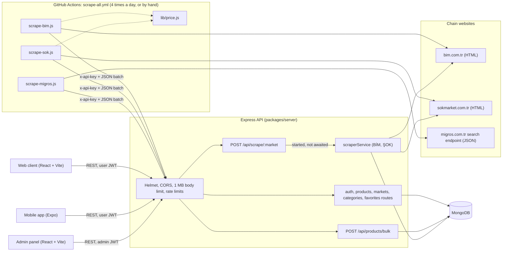
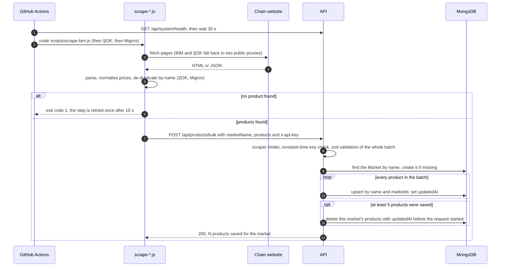
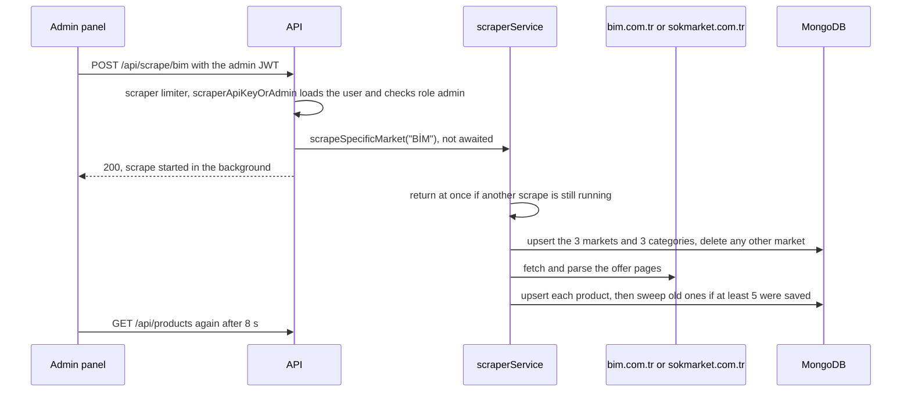
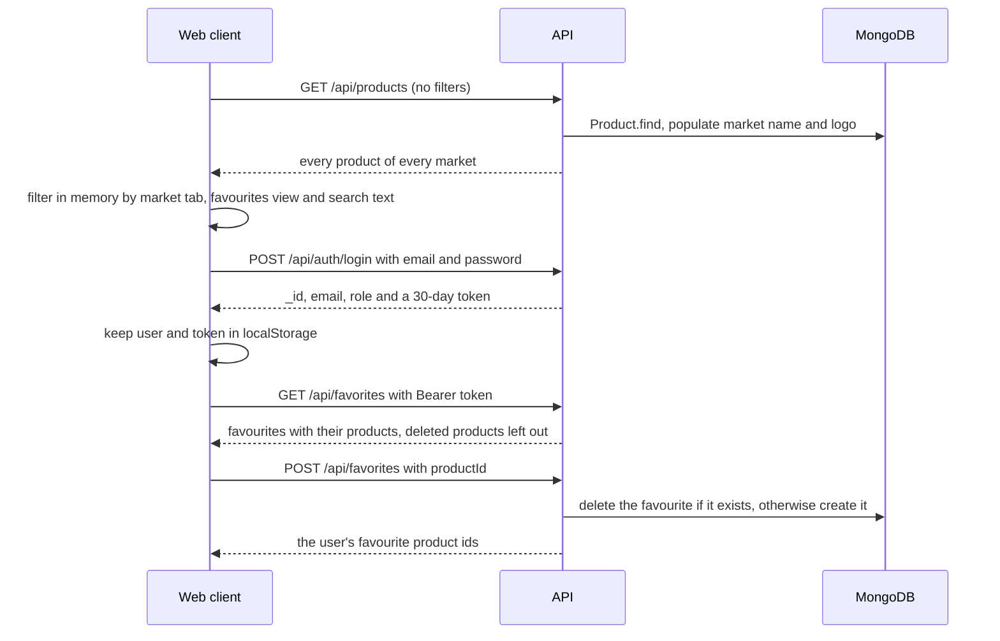
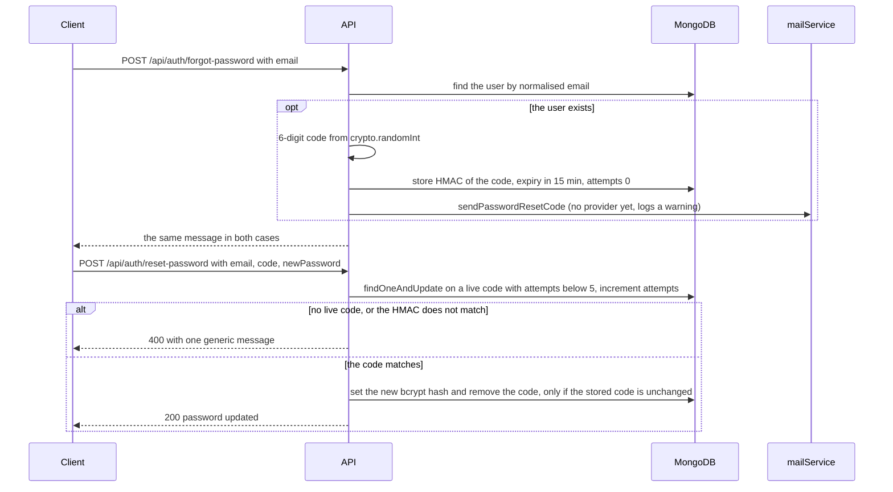
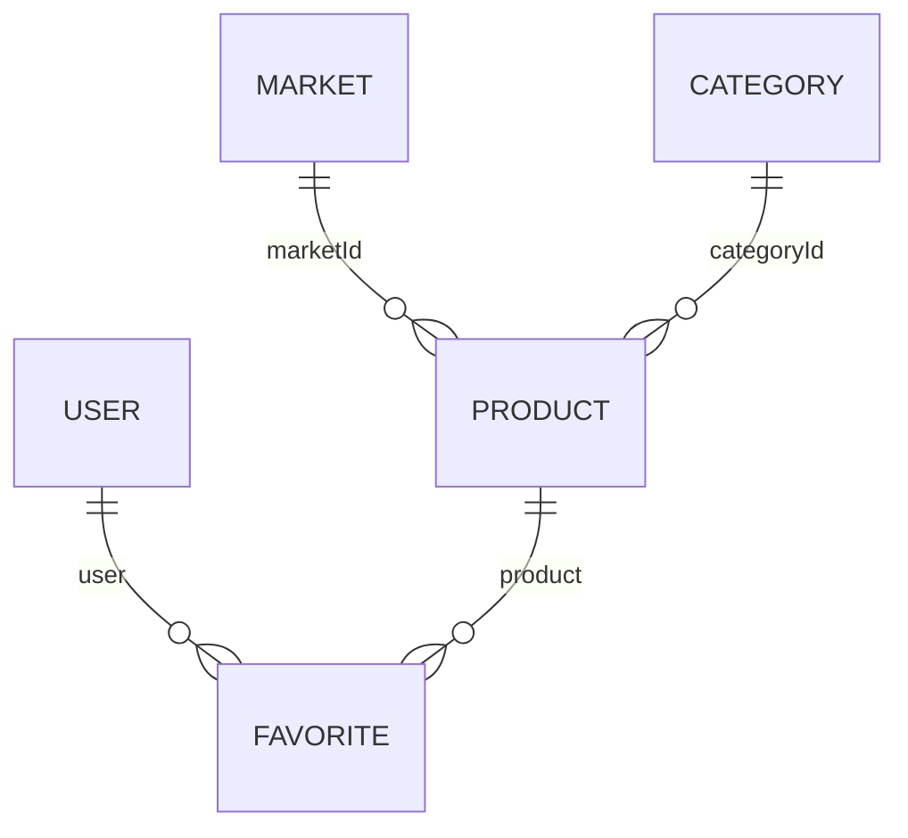
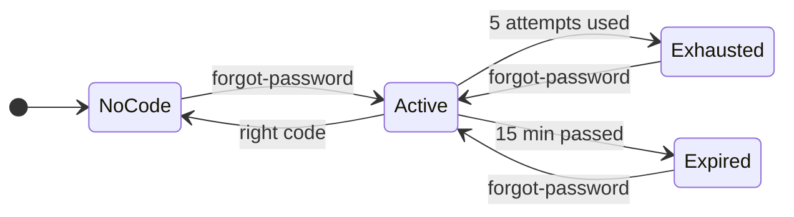

# How MarketApp works

This document explains the engineering behind MarketApp for a reader who has never seen the repository: what the
parts are, how data moves through them, the rules the code applies (price parsing, data replacement, password reset,
rate limiting) and why it is built this way. Every statement refers to the current code; links point to the file and
name the function or block to read.

For setup, configuration names and screenshots see the [README](../README.md). A short Turkish summary is at the end
([Türkçe özet](#türkçe-özet)).

## Contents

1. [What it is and what it is not](#1-what-it-is-and-what-it-is-not)
2. [Architecture](#2-architecture)
3. [Runtime flows](#3-runtime-flows)
4. [Data model](#4-data-model)
5. [Core logic in depth](#5-core-logic-in-depth)
6. [Security model](#6-security-model)
7. [Design decisions and trade-offs](#7-design-decisions-and-trade-offs)
8. [Testing strategy](#8-testing-strategy)
9. [Limitations, known gaps and next steps](#9-limitations-known-gaps-and-next-steps)
10. [Code tour](#10-code-tour)
11. [Glossary](#11-glossary)
12. [Türkçe özet](#türkçe-özet)

## 1. What it is and what it is not

**What it is.** MarketApp collects the weekly discount products ("aktüel" / "indirim" offers) of three Turkish
supermarket chains (BİM, ŞOK and Migros) and shows them in one feed. It has five parts:

- **Scrapers** (`scripts/`): three Node.js scripts, one per chain, run by a scheduled GitHub Actions workflow. They
  read the chains' public pages (BİM, ŞOK) or a public JSON search endpoint (Migros), turn every offer into one
  normalised product object and send the whole list for a chain to the API in a single request.
- **API** (`packages/server`): Express 5 + Mongoose on MongoDB. It stores the products, serves them, handles accounts
  (JWT), favourites and the password reset flow, and can also run its own BİM and ŞOK scraper when an admin asks.
- **Web client** (`packages/client`, shown as "MarketFırsat"): React + Vite page with market tabs, search,
  favourites and share buttons.
- **Admin panel** (`packages/admin`): React + Vite dashboard with per-market counts, product tables and buttons that
  start the server-side BİM / ŞOK scrape.
- **Mobile app** (`mobile/`, Expo / React Native): an early client with the same feed, a product detail screen and
  sign-in / register / password reset screens.

**What it is not.**

- Not a price comparison engine: products of different chains are never matched to each other. Each chain is a
  separate list.
- Not a price history: when a chain stops listing a product, the next full upload deletes it (see
  [5.4](#54-bulk-upload-and-the-replacement-rule)).
- Not a shop: there is no cart or ordering. Each product links to the chain's own page.
- Not categorised: a `Category` collection exists, but every scraped product is put into the "Gıda" category
  (see [4](#4-data-model)).
- Not affiliated with the chains; the data belongs to them.

**Honest status.** A working prototype. The API, web client and admin panel work and are built, linted and tested in
CI. Password reset codes are generated and verified, but no mail provider is connected, so a real user cannot
receive a code yet ([`mailService.ts` `sendPasswordResetCode`](../packages/server/src/services/mailService.ts)). The
mobile app is only type-checked in CI. The scrapers depend on the chains' current page structure and endpoints.

## 2. Architecture

| Component | Responsibility | Main code |
|---|---|---|
| Scheduled workflow | Wakes the API, runs the three scrapers one after another with one retry each, fails only if all three fail | [`scrape-all.yml`](../.github/workflows/scrape-all.yml) |
| Scrapers | Fetch, parse, normalise, de-duplicate, upload one batch per chain | [`scrape-bim.js`](../scripts/scrape-bim.js), [`scrape-sok.js`](../scripts/scrape-sok.js), [`scrape-migros.js`](../scripts/scrape-migros.js) |
| Price parser (scripts) | Turkish price text to number, ŞOK promotion threshold | [`lib/price.js` `parsePrice`, `parsePromotionPrice`](../scripts/lib/price.js) |
| API entry point | Required settings, production checks, database connection, `listen` | [`index.ts`](../packages/server/src/index.ts) |
| Express app | Middleware chain, rate limiters, CORS, bulk and scrape routes, error handler | [`app.ts`](../packages/server/src/app.ts) |
| Routes | Auth, products, markets, categories, favourites | [`routes/`](../packages/server/src/routes) |
| Middleware | JWT / admin / scraper-key checks, zod schemas, audit log | [`authMiddleware.ts`](../packages/server/src/middleware/authMiddleware.ts), [`validationMiddleware.ts`](../packages/server/src/middleware/validationMiddleware.ts), [`auditLogger.ts`](../packages/server/src/middleware/auditLogger.ts) |
| Server-side scraper | BİM and ŞOK scrape started from the admin panel, writing to MongoDB directly | [`scraperService.ts` `scrapeSpecificMarket`](../packages/server/src/services/scraperService.ts) |
| Helpers | Price parser (TypeScript copy), secrets, constant-time compare, reset codes, `TRUST_PROXY`, regex escaping | [`utils/price.ts`](../packages/server/src/utils/price.ts), [`utils/security.ts`](../packages/server/src/utils/security.ts) |
| Clients | Show the feed, log in, toggle favourites, trigger scrapes (admin) | [`client/src/App.tsx`](../packages/client/src/App.tsx), [`admin/src/App.tsx`](../packages/admin/src/App.tsx), [`mobile/App.tsx`](../mobile/App.tsx) |

**Request pipeline.** Every request to the API goes through the same chain, in this order
([`app.ts`](../packages/server/src/app.ts)):

1. `trust proxy` set to the hop count from `TRUST_PROXY` (only when it is above 0, see [6.3](#63-trust_proxy-and-client-ip-addresses)).
2. `helmet()` security headers.
3. `cors()` with an origin allow-list (see [6.5](#65-cors)).
4. `express.json` and `express.urlencoded`, both limited to 1 MB.
5. The global rate limiter (100 requests per minute per IP).
6. A console line per request (`<ISO time> - <method> <url>`).
7. Route-specific limiters on `/api/auth/login`, `/api/auth/forgot-password` and `/api/auth/reset-password`.
8. The routers, plus `/api/system/health`, `/api/scrape/:market` and `/api/products/bulk` defined in `app.ts`.
9. A final error handler that answers with JSON: a 4xx status from the error is kept with the message
   "Geçersiz istek.", anything else becomes 500 "Sunucu hatası." and only the message is logged, never a stack
   trace in the response.

## 3. Runtime flows

### 3.1 Scheduled scrape and bulk upload

The workflow runs at 03:00, 07:00, 12:00 and 18:00 UTC (06:00, 10:00, 15:00 and 21:00 in Türkiye) and can also be
started by hand (`workflow_dispatch`). It installs only `axios`, `cheerio` and `dotenv`, stops early if the
`SCRAPER_API_KEY` secret is empty, calls the health endpoint and waits 30 seconds so the hosted API is awake, then
runs BİM, ŞOK and Migros. Each scraper step is `continue-on-error` and is retried once after 10 seconds if it failed.
The final step fails the run only when all three markets failed.

### 3.2 Admin-triggered server-side scrape

The admin panel has "BİM Tarat" and "ŞOK Tarat" buttons. Migros has no server-side scraper; the panel links to the
workflow page instead, and `POST /api/scrape/migros` answers 400.

### 3.3 Browsing and favourites (web client)

The web client never uses the API's `search`, `marketId` or `categoryId` filters: it downloads all products once and
filters them in the browser ([`client/src/App.tsx` `filteredProducts`](../packages/client/src/App.tsx)). The mobile
app does the same ([`mobile/App.tsx` `HomeScreen`](../mobile/App.tsx)). If loading favourites returns 401 (expired or
invalid token), the web client signs the user out.

### 3.4 Password reset

The mobile app has the two screens for this flow ([`AuthScreen.tsx`](../mobile/src/screens/AuthScreen.tsx)); the web
client does not.

## 4. Data model

Five Mongoose models in [`packages/server/src/models`](../packages/server/src/models). All have `timestamps: true`
(`createdAt`, `updatedAt`). Only the indexes listed here exist; there are no compound indexes.

**Product** ([`Product.ts`](../packages/server/src/models/Product.ts))

| Field | Type | Meaning |
|---|---|---|
| `name` | String, required | Display name. Together with `marketId` it is the identity used by every upsert. |
| `marketId` | ObjectId → Market, required | The chain. Clients group products by the populated `marketId.name`. |
| `price` | Number, required | Current shelf price in lira. |
| `oldPrice` | Number | Struck-through price; scrapers set it to `price` when there is none. |
| `discountRate` | Number | Whole percent (BİM and Migros); ŞOK uploads do not send it. |
| `promotionPrice`, `promotionText` | Number, String | ŞOK basket promotions, e.g. text "50 TL üzeri 109.00 TL!" and price 109. |
| `imageUrl`, `sourceUrl` | String | Product image and the link the "Fırsatı Gör" button opens; only `http(s)` or empty values pass validation. |
| `categoryId` | ObjectId → Category | Always the "gida" category for scraped products, when it exists. |
| `isScraped` | Boolean, default false | Set to true by both scrape paths; nothing reads it. |
| `campaignStartDate`, `campaignEndDate` | Date | Defined in the schema; no code writes them. |
| `updatedAt` | Date (timestamps) | Set on every upsert; the replacement sweep deletes rows older than the upload. |

**Market** ([`Market.ts`](../packages/server/src/models/Market.ts)): `name` (required, not unique), `logoUrl`,
`isActive` (default true). The names `BİM`, `ŞOK` and `Migros` are the join key between the scrapers (`marketName`),
the API (`Market.findOne({ name })`) and the clients' tabs (`marketId.name === 'BİM'`).

**Category** ([`Category.ts`](../packages/server/src/models/Category.ts)): `name`, `slug` (unique), `icon`. The
server-side scraper upserts three: Gıda (`gida`), Temizlik (`temizlik`), Kişisel Bakım (`kisisel-bakim`); the demo
seed creates only Gıda.

**User** ([`User.ts`](../packages/server/src/models/User.ts)): `email` (unique), `passwordHash` (bcrypt),
`role` (`user` or `admin`, default `user`), and the reset state `resetPasswordToken` (hex HMAC of the code, never the
code), `resetPasswordExpires`, `resetPasswordAttempts` (default 0).

**Favorite** ([`Favorite.ts`](../packages/server/src/models/Favorite.ts)): `user` and `product` references, both
required. No unique index on the pair; uniqueness comes from the toggle logic in
[`favoriteRoutes.ts`](../packages/server/src/routes/favoriteRoutes.ts).

## 5. Core logic in depth

### 5.1 Turkish price parsing

Prices appear as `172,00₺`, `1.299,90 ₺`, `109.00 TL` or `1.299`. A naive `parseFloat` after replacing the comma
reads `1.299,90` as 1.299. The parser in [`scripts/lib/price.js` `parsePrice`](../scripts/lib/price.js) (identical
TypeScript copy in [`utils/price.ts` `parsePrice`](../packages/server/src/utils/price.ts)) applies these rules:

1. Remove everything except digits, `.` and `,`; then remove separators at the start and end.
2. No digit left: return `NaN` (callers skip the product).
3. No separator: plain number.
4. Find the **last** separator. If the text contains both kinds (`.` and `,`), the last one is the decimal
   separator.
5. If it contains only one kind, look at the digits after the last separator: exactly **three** digits means it was
   a thousands separator, anything else means decimals. The chains print prices with two decimals, so three
   trailing digits cannot be decimals.
6. All separators before the last one are thousands separators and are dropped.

| Input | Rule used | Result |
|---|---|---|
| `172,00₺` | one kind, 2 digits after: decimal | 172 |
| `1.299,90 ₺` | both kinds, last is decimal | 1299.9 |
| `109.00 TL` | one kind, 2 digits after: decimal | 109 |
| `1.299` | one kind, 3 digits after: thousands | 1299 |
| `12,500` | one kind, 3 digits after: thousands | 12500 |
| `1,299.50` | both kinds, last is decimal | 1299.5 |
| `TL` | no digit | NaN |

**BİM's split prices.** BİM prints the whole part and the decimals in two elements: `.text.quantify` holds `1.099,`
and `.kusurArea .number` holds `00`. [`utils/price.ts` `parseBimPrice`](../packages/server/src/utils/price.ts)
keeps only the digits of each part and joins them with a dot (`1099.00` → 1099). When the decimals element is
empty (struck-through prices come as one text such as `189,00` or `1.299`), it falls back to `parsePrice`. The
GitHub Actions BİM script has the same logic inline in its `getBimPrice` helper
([`scrape-bim.js`](../scripts/scrape-bim.js)).

**ŞOK promotion threshold.** [`parsePromotionPrice`](../scripts/lib/price.js) returns `undefined` unless the text
contains `üzeri` ("above"). It takes the first number after `üzeri` (regex `\d[\d.,]*`) and parses it with
`parsePrice`: `50 TL üzeri 109.00 TL!` → 109, `250 TL üzeri 1.099,00 TL!` → 1099. The basket threshold before
`üzeri` (50 TL) is not stored as a number; it stays in `promotionText`.

### 5.2 The three scrapers

All three scripts read `SCRAPER_API_KEY` at start-up and throw if it is missing, post to `API_URL` (default: the
hosted bulk endpoint) with a 120-second timeout, and exit with code 1 when they find no product, so the workflow
can retry them.

**BİM** ([`scrape-bim.js` `scrapeAndPushBim`](../scripts/scrape-bim.js))

1. Fetch `https://www.bim.com.tr/` through `fetchWithFallback`: a direct request first, then the public proxies
   `api.allorigins.win` and `api.codetabs.com`, each with a 25-second timeout. The first response that does not
   throw is used.
2. Find the offer column: in the first row of `.aktuelsubmenu table`, the cell whose upper-cased text contains
   `İNDİRİM` or `INDIRIM`; if none matches, column index 1 is used.
3. From that column of every row, collect the unique `Bim_AktuelTarihKey=<digits>` values from the links. Each key
   is one offer date. No key means the page changed: exit 1.
4. Fetch `https://www.bim.com.tr/?Bim_AktuelTarihKey=<key>` for each key, 1.5 seconds apart.
5. For each `.product` card that is not `.justImage`:
   - name = `.subTitle` + `.title` + `.gramajadet` (size or count), joined with spaces;
   - price from `.gButton.triangle`, old price from `.CountButton.strikethrough`, both through the split-price rule;
   - `discountRate` = the number in `.DiscountButton` if present, otherwise
     `round((oldPrice − price) / oldPrice × 100)` when `oldPrice > price`, otherwise 0;
   - image from the `xsrc` attribute (lazy loading) or `src`, made absolute with `https://www.bim.com.tr`;
   - cards without a name, a non-zero price or an image are skipped; `oldPrice` defaults to `price`;
   - `sourceUrl` is the offer-date page.
6. Upload all cards as one batch with `marketName: 'BİM'`. The BİM script does not de-duplicate; a repeated name is
   upserted twice and the later card wins.

**ŞOK** ([`scrape-sok.js` `scrapeAndPush`](../scripts/scrape-sok.js))

1. Fetch pages 1 to 4 of `https://www.sokmarket.com.tr/bunlari-kacirmayin-cms-mps53?page=N`, 2 seconds apart.
2. Same direct / two proxies order, but a response only counts if it contains at least one
   `div[class*="productCardWrapper"]`; a page with zero cards is treated as blocked and the next proxy is tried.
3. Selectors match class-name substrings (`[class*="module_title"]`, `[class*="module_price"]`,
   `[class*="promotionBadge"]`), with looser fallbacks (`[class*="title"]`, `[class*="price"]`) for name and price.
4. `price` = `parsePrice` of the first price element; `NaN` skips the card. `oldPrice` = `price`, because the list
   shows no struck-through price. `promotionPrice` = `parsePromotionPrice(promotionText)`.
5. De-duplicate by name (first occurrence wins) and upload with `marketName: 'ŞOK'`; `sourceUrl` is the list page.

**Migros** ([`scrape-migros.js` `scrapeAndPush`](../scripts/scrape-migros.js))

1. Call the JSON endpoint `https://www.migros.com.tr/rest/sanalmarket/products/search` with `q=indirim`, `page`
   (0-based) and `asc=false`, i.e. a catalogue search for the word "indirim".
2. Read at most `MAX_PAGES = 15` pages, 1.5 seconds apart; stop at an empty page or when `page >= pageCount − 1`.
3. Keep products with `discountRate >= MIN_DISCOUNT` (15) that have a `name` and a `shownPrice`.
4. Prices come as integers in kuruş (hundredths of a lira): `price = shownPrice / 100`,
   `oldPrice = regularPrice / 100` (or `price`). The image is `images[0].urls.PRODUCT_LIST`, then `PRODUCT_DETAIL`,
   then empty; `sourceUrl = https://www.migros.com.tr/<prettyName>`.
5. De-duplicate by name and upload with `marketName: 'Migros'`.

**Server-side BİM and ŞOK scraper** ([`scraperService.ts` `scrapeSpecificMarket`](../packages/server/src/services/scraperService.ts)).
The same parsing rules, with these differences: it writes to MongoDB directly instead of calling the bulk route; it
first runs `initMarketsAndCategories` (upsert the three markets with logo URLs, **delete every other market**, upsert
the three categories); BİM offer pages are requested with a 15-second timeout and a random 0.5 to 1.5 second pause
between keys, without a proxy, and `sourceUrl` is the card's own link; ŞOK reads only the first list page (no `page` parameter), tries a
direct request (20 s) and then only `api.allorigins.win` (30 s), and uses the card's link as `sourceUrl`. A
module-level `isScraping` flag allows one server-side scrape at a time, for both markets together; a second trigger
while one runs returns without scraping.

### 5.3 How a scraped offer becomes a Product

| Product field | BİM | ŞOK | Migros |
|---|---|---|---|
| `name` | subTitle + title + gramajadet | card title | `name` |
| `price` | split-price rule | `parsePrice` | `shownPrice / 100` |
| `oldPrice` | struck-through price, else `price` | `price` | `regularPrice / 100`, else `price` |
| `discountRate` | badge, else computed, else 0 | not sent | from the endpoint (at least 15) |
| `promotionText` / `promotionPrice` | not sent | badge text / threshold price | not sent |
| `imageUrl` | absolute `xsrc` / `src` | `img src` | `PRODUCT_LIST` or `PRODUCT_DETAIL` |
| `sourceUrl` (scripts) | offer-date page | list page | product page |

The API adds `marketId`, `categoryId` (the `gida` category), `isScraped: true` and `updatedAt`.

**How clients show a price** ([`client/src/App.tsx`](../packages/client/src/App.tsx), product card): the big price is
`promotionPrice || price`; the struck-through price is `price` when there is a promotion, otherwise `oldPrice`, and it
is only shown when it is higher than the big price. The `%N İNDİRİM` badge appears when `discountRate` is non-zero.

### 5.4 Bulk upload and the replacement rule

`POST /api/products/bulk` in [`app.ts`](../packages/server/src/app.ts) is the only way scheduled data enters the
database. Its steps and the invariants they give:

1. **Authenticate.** `scraperApiKeyOrAdmin` accepts either the `x-api-key` header or an admin JWT
   ([6.2](#62-who-may-call-what)).
2. **Validate the whole batch** with `bulkProductSchema`: `marketName` non-empty; at most 500 products; each product
   has a 1 to 200 character `name`, a non-negative `price`, optional non-negative `oldPrice` / `promotionPrice`,
   `discountRate` between 0 and 100, and `imageUrl` / `sourceUrl` that are `http(s)` URLs, empty or null. One bad
   product rejects the whole request with 400 and nothing is written.
3. **Find or create the market** by `marketName` (a new one gets an empty `logoUrl`).
4. **Remember `scrapeStartTime = new Date()`**, then upsert each product with filter `{ name, marketId }` and
   `$set` of the sent fields plus `marketId`, `categoryId`, `isScraped: true` and `updatedAt: new Date()`.
5. **Sweep.** If at least **5** products were saved, delete every product of that market whose `updatedAt` is older
   than `scrapeStartTime`. With fewer than 5, nothing is deleted.

What this guarantees:

- **Stable ids.** A product that is still on offer keeps its `_id` across uploads, because the upsert updates the
  existing document. Favourites (which store the product id) survive re-scrapes.
- **Only the latest offer list remains**, as long as a chain's whole list arrives in one request. The scrapers send
  one request per chain, and the 500-product cap applies to that request.
- **A broken scrape does not wipe a market.** Scripts never upload zero products (they exit 1), and an upload with
  fewer than 5 products only adds or updates.
- **One clock.** Both `scrapeStartTime` and `updatedAt` come from the API server's clock, so clock differences
  between the scraper machine and the server do not matter.

Caveats, visible in the code: `$set` only touches the fields that are sent, so a field that is missing from a later
upload keeps its old value (for example a ŞOK `promotionText` after the promotion ended, see
[9](#9-limitations-known-gaps-and-next-steps)); the sweep deletes all older products of the market, including ones
an admin created by hand; there is no unique index on `(name, marketId)`.

### 5.5 Accounts and JWT

[`authRoutes.ts`](../packages/server/src/routes/authRoutes.ts):

- **E-mail normalisation** happens in the zod schema: trimmed, lower-cased, at most 254 characters, e-mail format.
- **Register**: password 8 to 72 characters (the comment notes bcrypt's 72-byte input limit); 400 if the e-mail is
  taken; bcrypt hash with cost factor 10; responds 201 with `_id`, `email`, `role` and a token.
- **Login**: password 1 to 200 characters; different 401 messages for an unknown e-mail and a wrong password; both
  failures and successes are audit-logged.
- **Token**: `jwt.sign({ id }, JWT_SECRET, { expiresIn: '30d' })` with the library's default HMAC algorithm. The
  token holds only the user id. [`protect`](../packages/server/src/middleware/authMiddleware.ts) verifies it and
  loads the user from MongoDB on every request (without `passwordHash`), so a deleted user is rejected at once and a
  role change takes effect on the next request. [`admin`](../packages/server/src/middleware/authMiddleware.ts) then
  requires `role === 'admin'`. There is no token revocation: a token stays valid until it expires, also after a
  password reset.

### 5.6 Password reset state machine

[`authRoutes.ts` `/forgot-password` and `/reset-password`](../packages/server/src/routes/authRoutes.ts), with
`RESET_CODE_TTL_MS` = 15 minutes and `MAX_RESET_ATTEMPTS` = 5.

While a code is `Active`, a wrong code adds 1 to the attempt counter, and a new `forgot-password` replaces the code
and sets the counter back to 0. The right code sets the new password and removes the code and its expiry.

- **Code**: `crypto.randomInt(0, 1_000_000)` padded to 6 digits
  ([`security.ts` `generateResetCode`](../packages/server/src/utils/security.ts)).
- **Storage**: only `HMAC-SHA256(JWT_SECRET, "<userId>:<code>")` as hex
  ([`hashResetCode`](../packages/server/src/utils/security.ts)). A database dump alone does not reveal usable codes,
  and the same code for two users gives different hashes. Changing `JWT_SECRET` invalidates all open codes (and all
  tokens).
- **Attempt counting is atomic.** The first `findOneAndUpdate` only matches a user whose code is a string, whose
  expiry is in the future and whose `resetPasswordAttempts < 5`, and increments the counter in the same operation.
  Parallel requests therefore cannot use more than 5 attempts; the correct code also uses one. The integration test
  sends 8 wrong codes in parallel and expects the counter to stop at exactly 5.
- **Single use.** After the HMAC matches (constant-time compare), the second `findOneAndUpdate` sets the new hash
  only if `resetPasswordToken` is still the value just checked, and unsets the token and expiry. If a parallel
  request consumed it first, this one gets 400.
- **No information leak.** `forgot-password` returns the same body for known and unknown e-mails; the code is never
  in a response or a log line; every code failure of `reset-password` (unknown e-mail, no code, expired,
  attempts used up, wrong or already consumed) gets the same message. The schema only accepts a
  6-digit string as `token`, so `{"$ne": null}`-style operator objects are rejected before any query.

## 6. Security model

### 6.1 Production start-up checks (fail closed)

[`index.ts`](../packages/server/src/index.ts) exits with code 1 before connecting to the database when:

- `MONGODB_URI`, `JWT_SECRET` or `SCRAPER_API_KEY` is missing (any environment), or, with `NODE_ENV=production`,
  `CLIENT_ORIGIN`, `ADMIN_ORIGIN`, `ADMIN_EMAIL` or `ADMIN_PASSWORD` is missing;
- with `NODE_ENV=production`, `JWT_SECRET`, `SCRAPER_API_KEY` or `ADMIN_PASSWORD` equals (after trimming) one of the
  public placeholder values in [`security.ts` `PLACEHOLDER_SECRETS`](../packages/server/src/utils/security.ts):
  `change-me` (from `.env.example`), three older example values and a former hard-coded JWT fallback.

The match is exact; there is no length or entropy rule. Outside production the placeholders are accepted, so a local
copy of `.env.example` runs. [`seedAdmin.ts`](../packages/server/src/scripts/seedAdmin.ts) applies the same refusal to
`ADMIN_PASSWORD`; it runs before the server in `npm start`, creates the admin user or promotes the existing one and
re-applies the configured password on every start.

`getJwtSecret` throws when `JWT_SECRET` is missing instead of using a default, so signing, verifying and reset-code
hashing all fail rather than run with a guessable key.

### 6.2 Who may call what

| Route | Access |
|---|---|
| `GET /api/products`, `GET /api/markets`, `GET /api/categories`, `GET /api/system/health` | Public |
| `POST /api/auth/register`, `login`, `forgot-password`, `reset-password` | Public, validated, rate-limited |
| `GET` and `POST /api/favorites` | `protect` (any signed-in user) |
| `POST`, `PUT /:id`, `DELETE /:id` on `/api/products` and `/api/markets` | `protect` + `admin` |
| `POST /api/products/bulk`, `POST /api/scrape/:market` | `scraperApiKeyOrAdmin` |

[`scraperApiKeyOrAdmin`](../packages/server/src/middleware/authMiddleware.ts) works like this: if an `x-api-key`
header is present, it must be a string equal to `SCRAPER_API_KEY` (compared with
[`safeEqual`](../packages/server/src/utils/security.ts), which hashes both values with SHA-256 and uses
`crypto.timingSafeEqual`, so neither content nor length leaks through timing); a wrong key is 401 and the JWT path is
not tried. Without the header, a Bearer token of a user with role `admin` is accepted. A missing `SCRAPER_API_KEY` on
the server rejects every key.

### 6.3 `TRUST_PROXY` and client IP addresses

Rate limits are keyed by `req.ip`. Behind a reverse proxy, every request arrives from the proxy, so without
`trust proxy` all users would share one bucket. Express's `trust proxy = true` would instead take the left-most
`X-Forwarded-For` entry, which the client writes itself, and let anyone pick a new IP per request.
[`security.ts` `parseTrustProxy`](../packages/server/src/utils/security.ts) therefore only accepts a hop count:

| `TRUST_PROXY` | Result | Warning |
|---|---|---|
| unset or empty | 0 hops (`trust proxy` not set) | no |
| digits only, e.g. `1` (trimmed) | that many hops | no |
| `true` (any case) | 1 hop | yes |
| anything else (`false`, `-1`, `1.5`, `loopback`, a CIDR range) | 0 hops | yes |

With `n` hops Express takes the address `n` entries from the right of the chain, i.e. the one the trusted proxy
appended. [`trust-proxy.test.ts`](../packages/server/test/trust-proxy.test.ts) sends 11 logins that each forge a
different first `X-Forwarded-For` entry and checks that the 11th still gets 429. The audit log also uses `req.ip`, not
the raw header.

### 6.4 Rate limits

All limiters use `express-rate-limit` with its default in-memory store, respond with status 429 and a Turkish JSON
message, and send the standard `RateLimit-*` headers.

| Limiter | Mounted on | Window | Max per IP |
|---|---|---|---|
| `globalLimiter` | every request | 1 minute | 100 |
| `loginLimiter` (one instance, mounted twice) | `/api/auth/login` and `/api/auth/forgot-password` | 15 minutes | 10, shared by both paths |
| `resetPasswordLimiter` | `/api/auth/reset-password` | 15 minutes | 10 |
| `scrapeBulkLimiter` (one instance) | `/api/scrape/:market` and `/api/products/bulk` | 1 minute | 20, shared by both paths |

Because the same limiter instance (and store) is mounted on two paths, 10 login attempts also use up the
forgot-password budget of that IP. Register has only the global limit. Requests rejected by validation still count.

### 6.5 CORS

The allow-list is `CLIENT_ORIGIN` and `ADMIN_ORIGIN`. A request is allowed when it has no `Origin` header (for
example curl and the scraper scripts), when the origin is on the list, or, when `NODE_ENV` is `development` or unset,
when it starts with `http://localhost:` or `http://127.0.0.1:`. A disallowed origin gets a normal response without
CORS headers (so the browser blocks it) instead of an error that would become a 500. `credentials: true` is set. CORS
only limits browsers; the actual access control is the JWT and the scraper key.

### 6.6 Input validation and output safety

- zod schemas ([`validationMiddleware.ts`](../packages/server/src/middleware/validationMiddleware.ts)) replace
  `req.body` with the parsed value. Strings are required where strings are expected, so MongoDB operator objects
  cannot reach a query. Product and market links must be `http(s)` URLs because the clients render them as `href`
  and `src`; `javascript:` and `data:` URLs are rejected.
- `GET /api/products` rejects a `marketId` or `categoryId` that is not a single valid ObjectId, and a `search` that is
  not a single string of at most 100 characters (repeated query parameters arrive as arrays and are refused). The
  search text is escaped with [`escapeRegex`](../packages/server/src/utils/security.ts) and matched case-insensitively,
  so `.` or `(` are literal and cannot cause invalid-regex errors or catastrophic backtracking.
- The web client's [`vercel.json`](../packages/client/vercel.json) sets a Content-Security-Policy (scripts only from
  the same origin, API calls only to the same origin and the hosted API, images from `https:`, `data:` and `blob:`),
  `X-Frame-Options: DENY`, `X-Content-Type-Options`, `Referrer-Policy`, `Permissions-Policy` and HSTS.

### 6.7 Audit log

[`auditLogger.ts` `auditLogAction`](../packages/server/src/middleware/auditLogger.ts) writes one `[AUDIT]` console
line for logins, password reset requests and resets, admin create / update / delete, scrape triggers and bulk
uploads: user id (or the e-mail from the body for anonymous requests), role, action, method, route, `req.ip`, user
agent, status and optional details. JSON-looking `password`, `passwordHash`, `token`, `apiKey` and `x-api-key`
values in the details are replaced with `[REDACTED]`.

## 7. Design decisions and trade-offs

- **Scrape outside the API host, upload in one batch.** The scheduled scrapers run in GitHub Actions and only talk to
  the API through one authenticated, validated request per chain. The API does not need a scheduler, the scrapers
  can be retried on their own (one retry per chain, `continue-on-error`), and a chain that fails does not stop the
  others. The workflow wakes the hosted API before uploading, because the free hosting tier sleeps. The cost is a
  second copy of the parsing code: the scripts run with plain `node` and only `axios`, `cheerio` and `dotenv`
  installed, so they cannot import the server's TypeScript; `scripts/lib/price.js` and `utils/price.ts` are kept
  identical and each has its own tests.
- **Upsert plus timestamp sweep instead of delete-and-insert.** Deleting a market's products first and inserting the
  new list would give every product a new `_id` (breaking favourites) and would leave the market empty if the upload
  failed half way. Upserting by `(name, marketId)` keeps ids stable and keeps the old data until the new list is
  written; the sweep then removes what was not refreshed. The 5-product threshold is a guard against a scrape that
  only found a fragment of the page.
- **All-or-nothing validation.** One invalid product rejects the whole batch. A partly broken upload would
  otherwise be saved and could trigger the sweep with a shortened list. The price is that one bad link from a chain
  stops that chain's update until the scraper is fixed.
- **Fail closed where a default would be unsafe.** No JWT secret fallback; public placeholder secrets refused in
  production; a missing scraper key on the server rejects all keys; an unknown `TRUST_PROXY` value trusts no proxy;
  an unknown scrape market is a 400 instead of a fake "started"; any reset failure looks the same; a disallowed CORS
  origin simply gets no CORS headers.
- **Read the role from the database on each request.** A token only proves identity; permissions come from MongoDB.
  This costs one query per protected request and makes demotion or deletion effective immediately.
- **Filter in the client.** The web and mobile clients load all products once and switch markets, favourites and
  search locally. Tab switches need no request, but the response grows with the product count and there is no
  pagination.
- **Server-side scrape is fire-and-forget.** `POST /api/scrape/:market` returns as soon as the scrape starts; the
  admin panel reloads the list after 8 seconds. The request cannot time out while the scrape runs, but the panel
  never learns whether the scrape succeeded, and the `isScraping` guard skips a second trigger silently.
- **In-memory rate limits.** Simple and dependency-free, but counters reset on restart and are per process; several
  API instances would each keep their own counts.

## 8. Testing strategy

Two runners: Vitest + Supertest for the API ([`packages/server/test`](../packages/server/test), config in
[`vitest.config.ts`](../packages/server/vitest.config.ts)), and `node:test` for the scrapers' price helpers
([`price.test.js`](../scripts/lib/price.test.js)). The Vitest setup file sets test-only secrets and silences
`console.log` / `console.warn`. Files run one after another (`fileParallelism: false`) because the database suites
share one MongoDB server; each suite uses its own database name and drops it before and after.

Results of running the suites for this document (Node.js 22, local MongoDB 8.0 for the database run):

| Command | Result |
|---|---|
| `pnpm test` (no `TEST_MONGODB_URI`) | Vitest: 6 files passed, 3 skipped; 41 tests passed, 10 skipped (51). node:test: 5 passed. |
| `TEST_MONGODB_URI=mongodb://127.0.0.1:27017 pnpm test` | Vitest: 9 files passed; 51 tests passed. node:test: 5 passed. |

| File | Tests | Needs MongoDB | What it proves |
|---|---|---|---|
| [`app.test.ts`](../packages/server/test/app.test.ts) | 12 | no | JSON 400 for malformed JSON, validation instead of crashes, operator objects rejected, CORS without 500, ObjectId and repeated-parameter checks, wrong scraper key 401, bulk validation before the database, the removed debug route is 404, `migros` / unknown scrape markets 400 |
| [`security.test.ts`](../packages/server/test/security.test.ts) | 10 | no | `safeEqual`, `escapeRegex`, reset code format and HMAC binding, no JWT fallback, placeholder detection, `parseTrustProxy` table |
| [`validation.test.ts`](../packages/server/test/validation.test.ts) | 7 | no | zod schemas: operator objects, 6-digit code, e-mail normalisation, password length, favourite id, `http(s)`-only links |
| [`price.test.ts`](../packages/server/test/price.test.ts) | 7 | no | `parsePrice`, `parseBimPrice` (formats taken from saved BİM pages), `parsePromotionPrice` |
| [`trust-proxy.test.ts`](../packages/server/test/trust-proxy.test.ts) | 3 | no | `TRUST_PROXY=true` becomes 1 hop with one warning, forged `X-Forwarded-For` cannot bypass the login limit, audit log uses `req.ip` |
| [`startup.test.ts`](../packages/server/test/startup.test.ts) | 2 | no | The real `index.ts` and `seedAdmin.ts`, started in child processes with `NODE_ENV=production`, exit 1 on placeholder secrets |
| [`auth.reset.test.ts`](../packages/server/test/auth.reset.test.ts) | 3 | yes | Same response for unknown e-mails, code never returned and stored hashed, operator object rejected, code works exactly once |
| [`auth.reset-limits.test.ts`](../packages/server/test/auth.reset-limits.test.ts) | 3 | yes | 8 parallel wrong codes stop the counter at 5 and lock out the right code, expired code rejected, 11th reset request gets 429 |
| [`products.test.ts`](../packages/server/test/products.test.ts) | 4 | yes | Literal search (`.` and `(`), market filter with populated name, bulk upsert plus sweep, favourites validation and hiding of deleted products |
| [`price.test.js`](../scripts/lib/price.test.js) | 5 | no | The scripts' `parsePrice` and `parsePromotionPrice` |

The mail service is replaced with `vi.mock` in the reset tests, so the tests read the code that would have been
e-mailed.

**CI** ([`ci.yml`](../.github/workflows/ci.yml)) runs on every push and pull request. Job one: `pnpm install
--frozen-lockfile`, build of all workspace packages (`tsc` and Vite), API test type check, ESLint for the web client
and admin panel, and `pnpm test` with `TEST_MONGODB_URI` pointing at a `mongo:7` service container, so all 51 + 5
tests run. Job two: `npm ci` and `tsc --noEmit` for the mobile app, which is not part of the pnpm workspace.

**Not covered by tests:** the scrapers' HTML and JSON parsing against live pages (only the price helpers are tested),
the server-side scraper service, the admin CRUD routes, register / login responses beyond what the reset and
favourites tests use, and the three clients (they are type-checked and linted, not tested).

## 9. Limitations, known gaps and next steps

**Gaps visible in the code**

- No mail provider: [`sendPasswordResetCode`](../packages/server/src/services/mailService.ts) only logs a warning.
- Stale optional fields: the bulk upsert `$set`s only the fields a scraper sends. When a ŞOK promotion ends, the next
  upload has no `promotionText` / `promotionPrice` for that product, so the old promotion stays and the clients keep
  showing the promotion price as the current price. The server-side ŞOK scraper behaves the same way.
- The sweep deletes all older products of the market, including products an admin created by hand; `isScraped` is
  written but never used to protect them.
- A server-side scrape deletes every market other than BİM, ŞOK and Migros (`initMarketsAndCategories`); products of
  a deleted market stay in the database with a dangling `marketId` and disappear from the clients' tabs.
- The two writers (bulk route and server-side scraper) are not coordinated; a sweep from one can remove rows the
  other wrote moments earlier.
- No unique index on `(name, marketId)` or on favourite `(user, product)`; the favourite toggle reads then writes, so
  two very fast clicks can create a duplicate.
- The login route keeps a fallback for mixed-case e-mails of older accounts, but the zod schema already lower-cases
  the e-mail, so the fallback runs the same query again and never finds such an account. The repository has a
  one-off script for that case ([`scratch/normalize_emails.ts`](../scratch/normalize_emails.ts)).
- Login and register reveal whether an e-mail is registered; tokens live 30 days, are stored in `localStorage` by
  the web client and are not revoked by a password reset.
- Client-side search uses `toLowerCase()`, which is not Turkish-aware: a name written in capitals with `İ`
  (e.g. `PEYNİR`) does not match the search `peynir`.
- All products are put into the "Gıda" category; `campaignStartDate` / `campaignEndDate` are never filled.
- No pagination on `GET /api/products`; one upload per chain is limited to 500 products.
- The admin panel's "Ürün Yönetimi" and "Marketler" menu items open the same dashboard; the CRUD routes exist only
  in the API. The panel cannot see whether a server-side scrape succeeded.
- The scrapers depend on the chains' current markup, URL patterns and the Migros endpoint; the BİM and ŞOK fallbacks
  use third-party public proxies.
- Unused code and dependencies: `node-cron` in the server, `react-router-dom` and `src/types.ts` in the web client,
  `triggerBimScrape` / `triggerSokScrape` and the identity function `getSafeUrl` in the scraper service.

**Natural next steps**

1. Connect a mail provider in `mailService.ts` and add the reset screens to the web client.
2. Make the upload a full replacement per product (unset optional fields that were not sent) and limit the sweep to
   `isScraped: true`.
3. Add unique indexes on `(marketId, name)` and favourite `(user, product)`.
4. Add pagination or server-side filtering to `GET /api/products` and use it in the clients.
5. Use `toLocaleLowerCase('tr')` for search, or the API's search.
6. Report the result of a server-side scrape (status endpoint or job record) and add parser tests on saved pages.
7. Shorter-lived tokens in an `httpOnly` cookie, or a token version on the user that a password reset increments.

## 10. Code tour

Read in this order:

1. [`.github/workflows/scrape-all.yml`](../.github/workflows/scrape-all.yml): when and how data is refreshed.
2. [`scripts/lib/price.js`](../scripts/lib/price.js): the price rules everything depends on.
3. [`scripts/scrape-bim.js`](../scripts/scrape-bim.js): a complete scraper, from date keys to the bulk upload.
4. [`scripts/scrape-migros.js`](../scripts/scrape-migros.js): the JSON-based scraper and its discount filter.
5. [`packages/server/src/index.ts`](../packages/server/src/index.ts): start-up checks.
6. [`packages/server/src/app.ts`](../packages/server/src/app.ts): middleware order, limiters, CORS, bulk and scrape routes.
7. [`packages/server/src/middleware/authMiddleware.ts`](../packages/server/src/middleware/authMiddleware.ts): `protect`, `admin`, `scraperApiKeyOrAdmin`.
8. [`packages/server/src/middleware/validationMiddleware.ts`](../packages/server/src/middleware/validationMiddleware.ts): every input schema.
9. [`packages/server/src/routes/authRoutes.ts`](../packages/server/src/routes/authRoutes.ts): register, login and the reset state machine.
10. [`packages/server/src/utils/security.ts`](../packages/server/src/utils/security.ts): secrets, constant-time compare, reset codes, `TRUST_PROXY`.
11. [`packages/server/src/services/scraperService.ts`](../packages/server/src/services/scraperService.ts): the server-side scraper.
12. [`packages/client/src/App.tsx`](../packages/client/src/App.tsx): how the feed, favourites and prices are shown.

## 11. Glossary

| Term | Meaning |
|---|---|
| Aktüel | A chain's weekly special-offer products, published for a given date. |
| İndirim | Discount. Also the BİM menu column that holds discount date keys, and the Migros search word. |
| `Bim_AktuelTarihKey` | BİM's query parameter for one offer date ("tarih" = date); the scraper collects these keys. |
| Gramaj / adet | Weight or piece count; BİM's `.gramajadet` element, appended to the product name. |
| Kuruş | One hundredth of a Turkish lira; Migros prices are integers in kuruş. |
| "50 TL üzeri …" | ŞOK basket promotion: the product costs the second price when the basket is above the first amount ("üzeri" = above). |
| Gıda | "Food"; the default category of every scraped product. |
| MarketFırsat | The web and mobile client's display name ("market deal"). |
| Bulk upload | `POST /api/products/bulk`: one chain's whole offer list in one request. |
| Sweep | Deleting a market's products that the latest upload (5 or more products) did not refresh. |
| Scraper key | The shared secret `SCRAPER_API_KEY`, sent in the `x-api-key` header. |
| Hop count | Number of reverse proxies in front of the API, the only form `TRUST_PROXY` accepts. |
| Placeholder secret | A public example value (`change-me` and older ones) that production refuses. |
| Tarat | "Scan"; the admin buttons "BİM Tarat" and "ŞOK Tarat" start the server-side scrape. |

## Türkçe özet

MarketApp; BİM, ŞOK ve Migros'un haftalık indirimli ürünlerini toplayıp tek bir akışta gösteren bir prototiptir.
GitHub Actions'taki zamanlanmış iş akışı günde dört kez üç veri çekici betiği çalıştırır: BİM ve ŞOK sayfaları
Cheerio ile ayrıştırılır (erişilemezse iki açık proxy denenir), Migros için herkese açık JSON arama uç noktası
kullanılır. Türkçe fiyatlar tek bir kuralla sayıya çevrilir (iki ayraç varsa sondaki ondalıktır; tek tür ayraçtan
sonra tam üç rakam varsa binlik ayraçtır), her market listesi tek istekte, scraper anahtarıyla
`/api/products/bulk` adresine gönderilir. API tüm partiyi zod ile doğrular, ürünleri `(name, marketId)` ile upsert
eder ve en az 5 ürün kaydedildiyse yükleme başlamadan önce güncellenmiş eski ürünleri siler; böylece ürün kimlikleri
(ve favoriler) korunur, bozuk bir tarama marketi boşaltmaz.

API Express 5 ve MongoDB üzerinde çalışır: JWT ile kimlik doğrulama (rol her istekte veritabanından okunur),
favoriler, yöneticiye özel uç noktalar ve 15 dakika geçerli, en fazla 5 denemeli, HMAC olarak saklanan 6 haneli
kodlarla şifre sıfırlama. Güvenlik tarafında üretimde yer tutucu gizli değerler reddedilir, `TRUST_PROXY` yalnızca
proxy sayısı olarak okunur, istek sınırları ve CORS izin listesi uygulanır. Testler bu belge için çalıştırıldı:
veritabanı olmadan 41 test geçti, 10'u atlandı; MongoDB ile 9 dosyada 51 testin tamamı ve 5 `node:test` testi geçti.

- **Bileşenler:** veri çekiciler (`scripts/`), API (`packages/server`), web istemcisi, yönetim paneli, erken aşamada
  mobil uygulama.
- **Değiştirme kuralı:** tek parti, tam doğrulama, upsert, en az 5 üründe eski kayıtların silinmesi.
- **Fiyat kuralları:** BİM'in ayrık fiyat alanları birleştirilir; ŞOK kampanya fiyatı "üzeri" kelimesinden sonraki
  sayıdan alınır; Migros fiyatları kuruş olarak gelir ve 100'e bölünür; Migros'ta yalnızca %15 ve üzeri indirimler
  tutulur.
- **Bilinen eksikler:** e-posta sağlayıcısı yok; sona eren ŞOK kampanyası metni bir sonraki yüklemede silinmiyor;
  kategori sınıflandırması ve sayfalama yok; token iptali yok; istemci araması Türkçe büyük `İ` harfini dikkate almıyor.
- **Okumaya başlama sırası:** `scrape-all.yml`, `scripts/lib/price.js`, `scrape-bim.js`, `app.ts`,
  `authMiddleware.ts`, `authRoutes.ts`, `security.ts`, `client/src/App.tsx`.
